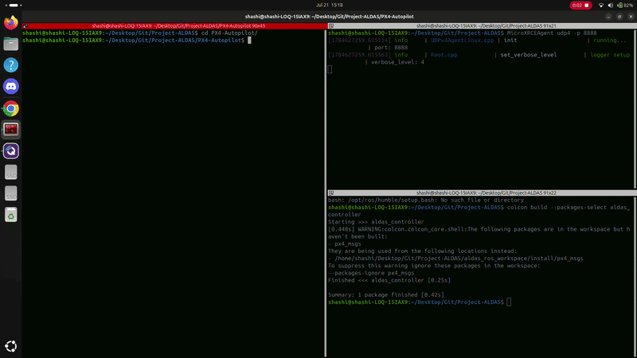

<div align="center">


# ALDAS

### Autonomous Launching and Docking Assistance System

**Autonomous UAV Launch, Docking, and Charging using a Mobile Ground Rover**


</div>

---

# Overview

ALDAS (Autonomous Launching and Docking Assistance System) is a robotics platform designed to enable autonomous launch, precision docking, and charging of an Unmanned Aerial Vehicle (UAV) using a mobile Unmanned Ground Vehicle (UGV).

The objective is to enable a fully autonomous mission cycle by allowing the UAV to:

- Launch from a mobile ground rover
- Perform autonomous missions
- Detect and align with the moving docking station
- Execute precision landing
- Recharge onboard
- Relaunch for subsequent missions

The project integrates **PX4**, **Gazebo Harmonic**, and **ROS 2 Jazzy** to provide a realistic simulation environment before deployment on physical hardware.

---

# Features

- Autonomous UAV launch and docking
- Custom PX4 Gazebo simulation model
- Integrated RGB Monocular Camera
- Integrated Depth Camera
- Integrated 1D LiDAR
- ROS 2 Integration
- PX4 Offboard Control Support
- Gazebo Harmonic Simulation
- Modular project architecture

---

# Custom Gazebo Vehicle

A custom Gazebo model named

```text
4022_gz_x500_docking
```

has been developed specifically for ALDAS.

Instead of using multiple independent PX4 simulation models, this vehicle combines the capabilities of several existing Gazebo drone models into a single platform designed for autonomous docking research.

### Integrated Sensor Suite

- Depth Camera OAK-D Lite
- 1D LiDAR Downward
- Downward RGB Docking Camera

This unified platform enables realistic autonomous docking experiments without switching between different simulation models.

---

# System Architecture

<div align="center">


</div>

---

# Repository Structure

```text
Project-ALDAS
│
├── PX4-Autopilot
│
├── aldas_ros_workspace
│   ├── src
│   ├── build
│   ├── install
│   └── log
│
├── thirdparty
│   └── Micro-XRCE-DDS-Agent
│
├── assets
│
├── docs
│
├── README.md
│
└── LICENSE
```

---

# Prerequisites

- Ubuntu 24.04 LTS
- ROS 2 Jazzy
- Gazebo Harmonic
- PX4 Autopilot
- Micro XRCE-DDS Agent
- CMake
- Ninja
- Python 3

Detailed installation instructions are available in:

```text
docs/setup.md
```

---

# Quick Start

### 1. Clone the Repository

```bash
git clone --recursive <repository-url>

cd Project-ALDAS
```

### 2. Build PX4

```bash
cd PX4-Autopilot

bash Tools/setup/ubuntu.sh

make px4_sitl
```

### 3. Launch the Simulation

```bash
cd PX4-Autopilot

make px4_sitl 4022_gz_x500_docking
```

This launches:

- PX4 SITL
- Gazebo Harmonic
- Custom docking UAV
- Complete onboard sensor suite

---


# Current Development Progress

<div align="center">



**Current Autonomous Launching and Docking Simulation**

</div>

---


# Available Sensors

| Sensor | Example Topic |
|----------|---------------|
| RGB Camera | `/world/default/model/4022_gz_x500_docking/.../camera/image` |
| Depth Camera | `/world/default/model/4022_gz_x500_docking/.../depth_camera` |
| 1D LiDAR | `/world/default/model/4022_gz_x500_docking/.../scan` |
| IMU | `/imu` |
| GPS | `/navsat` |

---

# Documentation

| Document | Description |
|----------|-------------|
| `docs/setup.md` | Development environment setup |
| `docs/simulation.md` | Running the simulation |
| `docs/architecture.md` | System architecture |
| `docs/development-notes.md` | Development notes and implementation details |
| `docs/known-issues.md` | Known issues, debugging logs, and fixes |

---

# Development Roadmap

- UAV–UGV Communication
- Vision-Based Docking
- Precision Autonomous Landing
- Rover Navigation
- Battery Charging Simulation
- Hardware Integration
- Docker-Based Development Environment
- Multi-Drone Support

---


# Contributors

<div align="center">

**ALDAS Development Team**

</div>

---

# License

This project is licensed under the MIT License.

See the [LICENSE](LICENSE) file for details.

---

# Acknowledgements

This project builds upon the work of the open-source robotics community.

Special thanks to:

- PX4 Autopilot
- Gazebo Harmonic
- ROS 2
- MAVLink
- eProsima Micro XRCE-DDS

Their contributions have made this project possible.
