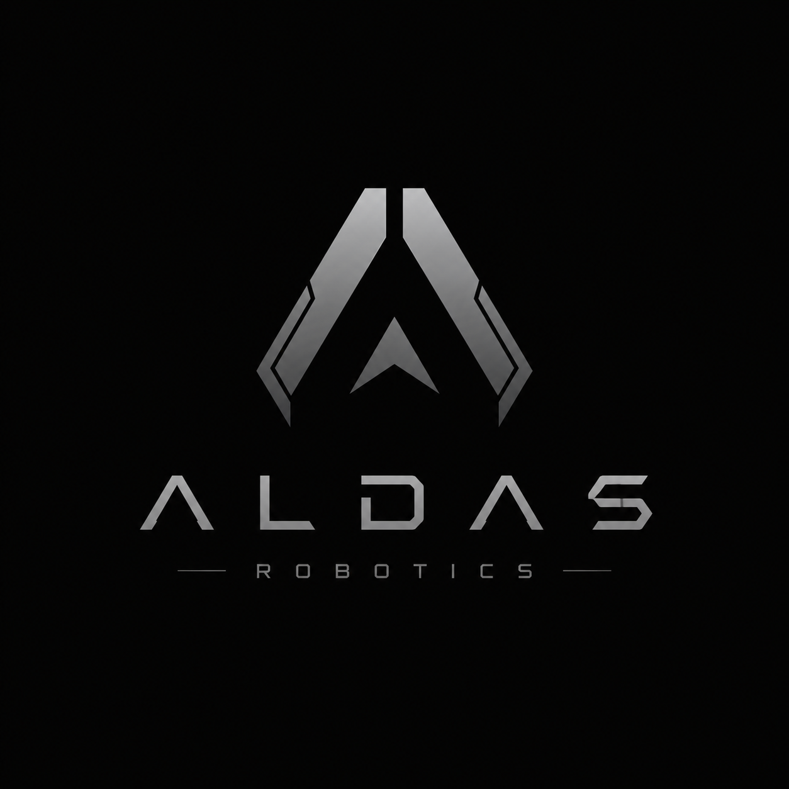
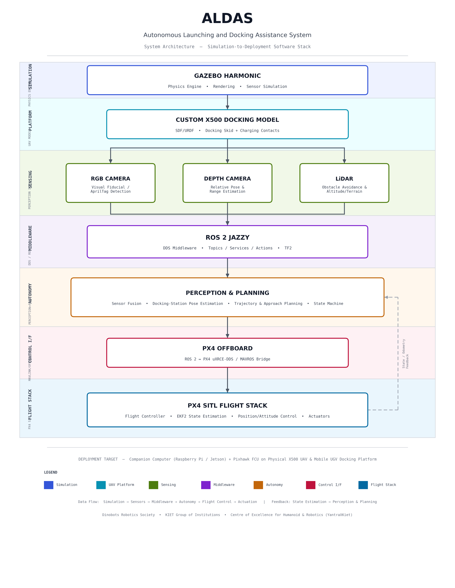

<div align="center">



# ALDAS

### Autonomous Launching and Docking Assistance System

**Autonomous UAV Launch, Docking, and Charging using a Mobile Ground Rover**


</div>

---

# Overview

ALDAS (Autonomous Launching and Docking Assistance System) is a robotics platform designed to enable autonomous launch, precision docking, and charging of an unmanned aerial vehicle (UAV) using a mobile unmanned ground vehicle (UGV).

The objective is to eliminate manual intervention by allowing a drone to repeatedly:

- Launch from a mobile rover
- Perform autonomous missions
- Detect and align with the moving docking station
- Land accurately
- Recharge
- Repeat the mission cycle

The project integrates **PX4**, **Gazebo Harmonic**, and **ROS 2 Jazzy** to provide a realistic simulation environment before deployment on physical hardware.

---

# Features

- Autonomous UAV launch and docking
- Custom PX4 Gazebo simulation model
- Integrated RGB Camera
- Integrated Depth Camera
- Integrated 2D LiDAR
- ROS 2 Integration
- PX4 Offboard Control Support
- Gazebo Harmonic Simulation
- Modular project architecture

---

# Custom Gazebo Vehicle

A custom Gazebo vehicle named

```
4022_gz_x500_docking
```

has been developed specifically for ALDAS.

Instead of using multiple independent PX4 models, the drone combines several existing Gazebo models into a single simulation platform.

## Integrated Sensors

- RGB Monocular Camera
- Depth Camera
- 2D LiDAR
- Downward RGB Docking Camera
- Downward Docking LiDAR

This unified platform enables realistic autonomous docking experiments without switching between different simulation models.

---

# System Architecture

<div align="center">



---

# Repository Structure

```
Project-ALDAS
│
├── PX4-Autopilot
│
├── aldas_ros_workspace
│   ├── src
│   ├── build
│   ├── install
│   └── log
│
├── thirdparty
│   └── Micro-XRCE-DDS-Agent
│
├── assets
│
├── docs
│
├── README.md
│
└── LICENSE
```

---

# Prerequisites

- Ubuntu 24.04 LTS
- ROS 2 Jazzy
- Gazebo Harmonic
- PX4-Autopilot
- Micro XRCE-DDS Agent
- CMake
- Ninja
- Python 3

Detailed installation instructions are available in:

```
docs/setup.md
```

---

# Clone Repository

```bash
git clone --recursive <repository-url>

cd Project-ALDAS
```

---

# Build PX4

```bash
cd PX4-Autopilot

bash Tools/setup/ubuntu.sh

make px4_sitl
```

---

# Launch Simulation

```bash
cd PX4-Autopilot

make px4_sitl 4022_gz_x500_docking
```

This launches:

- PX4 SITL
- Gazebo Harmonic
- Custom docking drone
- Integrated sensor suite

---

# Sensor Topics

## RGB Camera

```
/world/default/model/4022_gz_x500_docking/.../camera/image
```

---

## Depth Camera

```
/world/default/model/4022_gz_x500_docking/.../depth_camera
```

---

## 2D LiDAR

```
/world/default/model/4022_gz_x500_docking/.../scan
```

---

## IMU

```
/imu
```

---

## GPS

```
/navsat
```

---

# Development Roadmap

- UAV–UGV Communication
- Vision-based Docking
- AprilTag Pose Estimation
- Autonomous Precision Landing
- Rover Navigation
- Battery Charging Simulation
- Hardware Integration
- Multi-Drone Support

---

# Documentation

| Document | Description |
|----------|-------------|
| docs/setup.md | Environment setup |
| docs/simulation.md | Running the simulation |
| docs/architecture.md | System architecture |
| docs/development-notes.md | Development notes |
| docs/known-issues.md | Known issues and fixes |

---


# Contributors

<table>
<tr>
<td align="center">
<b>ALDAS Development Team</b>
</td>
</tr>
</table>

---

# License

This project is licensed under the MIT License.

See the [LICENSE](LICENSE) file for details.

---

# Acknowledgements

This project is built upon the work of the following open-source communities:

- PX4 Autopilot
- Gazebo Harmonic
- ROS 2
- MAVLink
- eProsima Micro XRCE-DDS

Their contributions have made this project possible.
